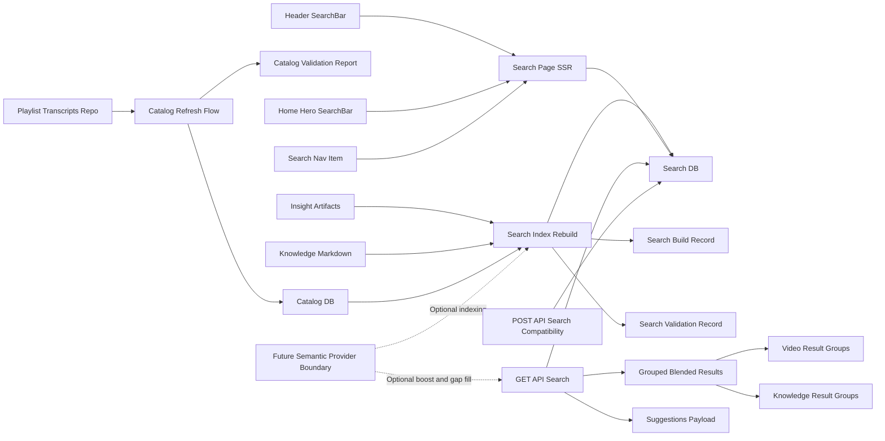

# Search System Diagram

```mermaid
flowchart LR
    A[Playlist Transcripts Repo] --> B[Catalog Refresh Flow]
    B --> C[Catalog DB]
    B --> D[Catalog Validation Report]

    E[Insight Artifacts] --> F[Search Index Rebuild]
    G[Knowledge Markdown] --> F
    C --> F

    F --> H[Search DB]
    F --> I[Search Build Record]
    F --> J[Search Validation Record]

    K[Search Page SSR] --> H
    L[GET API Search] --> H
    M[POST API Search Compatibility] --> H

    N[Header SearchBar] --> K
    O[Home Hero SearchBar] --> K
    P[Search Nav Item] --> K

    L --> Q[Grouped Blended Results]
    L --> R[Suggestions Payload]

    Q --> S[Video Result Groups]
    Q --> T[Knowledge Result Groups]

    U[Future Semantic Provider Boundary] -. Optional boost and gap fill .-> L
    U -. Optional indexing .-> F
```
